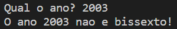
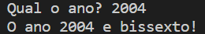

# Estrutura de Dados: uso do "if" em C++

## Calculadora de IMC:

Usei os objetos "cout" e "cin" para entrada de dados:

  

## Ano bissexto:

Novamente, usei "cout" e "cin":

  

  

### Observação
Não aprendemos a configurar a saída dos dados com os acentos existentes no idioma português, por isso no arquivo _bissexto.cpp_ nos é devolvido "O ano 2003 **nao e** bissexto!" e não "O ano 2003 **não é** bissexto!"